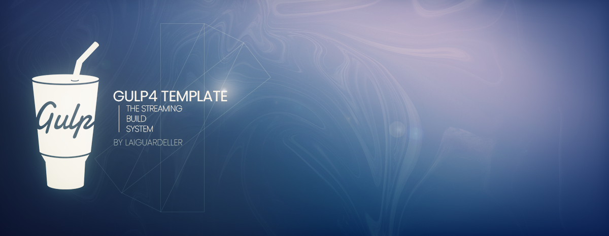

# Gulp 4 Template

**This Gulp 4 template developed for lightweight static web-sites**



### The [Gulp](https://gulpjs.com/) template was made for
## 🔥 Fast and comfortable developing static web-sites 🔥

Let me describe this.
## Features
- ES6 syntax support for gulpfile
- All tasks are structured in their folders
- NPM scripts for start, build and optional tasks
- Nice and clean build and dev tasks
- All things you need in your static web-dev
- I'll try to please you with updates ;)


Template's Folder Structure
============================

> This template have standard folders such as src, dist, gulp.

### Detailed directory layout

    .
    ├── dist                # Compiled  project
    ├── gulp                # Templates main folder
    │   ├── tasks           # All gulp tasks are described here
    │   └── config.js       # Paths config
    ├── src                 # Source files
    │   ├── css             # Compiled SASS goes here
    │   ├── favicon         # Your websites' favicon is placed here
    │   ├── fonts           # Here you can place your fonts
    │   ├── img             # Images folder
    │   │   ├── sprite      # Builded sprite folder
    │   │   └── svg         # Source svg is placed here
    │   ├── js              # JavaScript folder after compile
    │   ├── libs            # All your libs are placed here
    │   ├── pages           # Pug's template files
    │   ├── sass            # SASS source folder
    │   └── ucripts         # Write your JS here
    ├── .babelrc            # Babel config
    ├── .eslintrc.js        # Eslint config
    ├── .gitignore          # Ignore files are descripted here
    ├── .prettierrc         # Prettier config
    ├── gulpfile.babel.js   # All magic is placed here
    ├── .package.json       # Dependencies are described here
    └── README.md
## Main Stack
In this template you can see modern stack of technologies:

- [Gulp](https://gulpjs.com/) - this is it ;)
- [Pug](https://pugjs.org/api/getting-started.html) - HTML-template engine
- [Sass](https://sass-lang.com/) - cool css-preprocessor
- [Babel](https://babeljs.io/) - compiling your ES6 javascript for better supporting


## Installation

Template requires [NodeJS](https://nodejs.org/en/), install this if you haven't yet.
Next, you need to install dependencies via [npm](https://www.npmjs.com/):

```sh
npm i
```

> all following steps we will do with npm, but you can type `gulp start` or something else after installing
> Optional: you also able to install in your IDE this plugins: [Prettier](https://prettier.io/), [Eslint](https://eslint.org/)

All done! To launch this template you can write:

```sh
npm run start
```

## Main Plugins

Template currently works with the following plugins.
Description on what plugins are included is below.

| Plugin | Description |
| ------ | ------ |
| [Babel](https://babeljs.io/) | JavaScript compiler |
| [Eslint](https://www.npmjs.com/package/eslint) | JavaScript linter |
| [Gulp](https://www.npmjs.com/package/gulp) | The streaming build system |
| [gulp-autoprefixer](https://www.npmjs.com/package/gulp-autoprefixer) | Prefix CSS |
| [gulp-group-css-media-queries](https://www.npmjs.com/package/gulp-group-css-media-queries) | Groups your media queries |
| [gulp-pug](https://www.npmjs.com/package/gulp-pug) | Gulp plugin for compiling Pug templates |
| [gulp-sass](https://www.npmjs.com/package/gulp-sass) | Gulp plugin for compiling Sass templates |
| [gulp-ttf2woff](https://www.npmjs.com/package/gulp-ttf2woff) | Create a WOFF font from a TTF |
| [gulp-ttf2woff2](https://www.npmjs.com/package/gulp-ttf2woff2) | Create a WOFF2 font from a TTF |

This is not the full list of plugins, you can open `${package.json}`
to see all plugins that I used in this template.

## Additional tasks

I made optional tasks to make your developing more comfortable.
You can run:
```
npm run font
```
To compile your TTF fonts to WOFF/WOFF2, this is easy!

Also you can minify your images after build, write:
```
npm run img
```

This task will take all your images from `src` and minify them,
then it will unload them to `dist` folder.


#### Building
After coding, you can build your project via
```
npm run build
```

### Thanks for watching! 😄